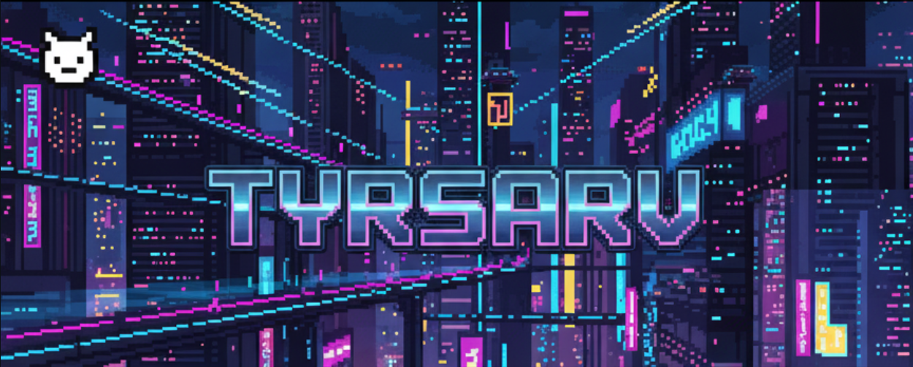

<h1 align="center">♖ Hola, mi nombre es Santiago Arevalo ♖</h1>

### Freelance junior

  

Soy un estudiante de ingeniería de software desde 2023!

Que viene desde lo básico, sin alardes, aprendiendo a punta de disciplina, caídas y levantadas. No presumo de saberlo todo, pero lo que sí tengo claro es que no le saco el cuerpo a ningún reto. Si toca aprender algo desde cero, se aprende; si toca romper el código diez veces hasta que funcione, pues se rompe.

Me gusta construir cosas que tengan sentido, que sirvan, y que me hagan mejor que ayer. No soy el más flashy del planeta, pero trabajo con una constancia que hace ruido. Mi meta es simple: crecer, aportar y seguir afinando mi cabeza para crear soluciones cada vez más sólidas.

Bienvenido a mi espacio. No es el más lujoso, pero está levantado con ganas y con la intención de llegar lejos.

## Tecnologías que he utilizado a lo largo de mi formacion:

  
  
  
  
  
  
  
  
  
  
  
  
  
  
  
  
  
  
  
  
  
  
  
  
  
  
  
  
  
  

## Encuéntrame en:

## Contacto y apoyo:

